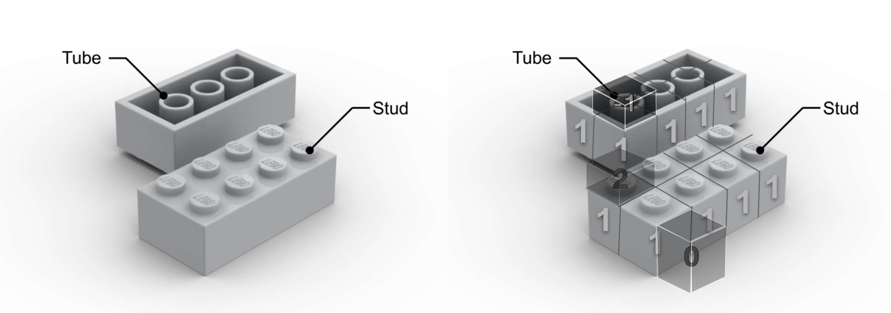

# PCG-Bricks: Procedural Content Generation placing Brick-like objects

This is a toy library for procedurally generating content in the form of brick-like objects. It is based on the [3D PCG Paper](https://arxiv.org/abs/2206.13623) by us, implementing the LEGO ish ideas. This is just a playground for writing some dirty code. Also this is a test bed for weird packages I want to try out. 
Built on top of previous genius works [gym-pcgrl](https://github.com/amidos2006/gym-pcgrl) and [control-pcgrl](https://github.com/smearle/control-pcgrl).

## To Do / Potential Features
1. Supervised way to generate structures (given a structure in LEGO / Minecraft, generate a similar structure), use least number of bricks / least number of steps to achieve this; find the "crucial bricks types" without which the structure cannot be built.
2. Use same set of bricks to generate 2 different structures (transfer between structures)
3. Make it text guided (generate a structure given a text description)
4. Make it image guided (generate a structure given an image)
5. Not only voxel based

## Implementation
1. use a tree structure to represent each point in the block? If you want to remove the block, you need to remove all the points in that action patch. Also need to represent the slubs (the points that can connect 2 bricks together) create a class for each brick type
2. [copilot propose this, also sounds interesting]use a graph structure to represent the structure, each node is a brick, each edge is a slub. If you want to remove a brick, you need to remove all the edges that connect to that brick. Also need to represent the slubs (the points that can connect 2 bricks together) create a class for each brick type
3. Represent the bricks: use a 3D array to represent the bricks, and extra "border" of the bricks to represent the stud and tube.
    3.1 in the surface of the array, use -1 to represent the tube, use 2 to represent the stud, use 0 to represent nothing (smooth surface without stud or tube or connection). With this representation, if we place a brick on top of another brick, we can just add the two arrays together, and vice versa. 1 means the connection point, 0 means no connection point.
    3.2 inside the array represent the brick type. 0 means no brick, 1 means brick type 1 , 2 means brick type 2, etc.

    See the plot here:
    
    

    3.3 During the building, we still can scan over the space sequentially, just punish the floating blocks and don't allow the overlap.